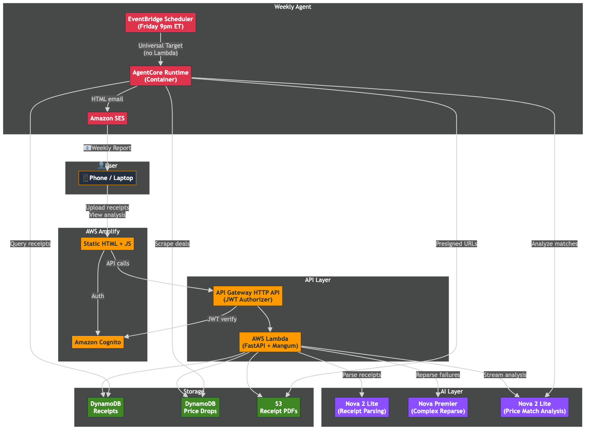

# Costco Receipt Scanner & Price Match Agent

AI-powered tool that scans your Costco receipts, cross-references purchases against active deals, and tells you exactly which items dropped in price and how much you can get back at the membership counter.

A weekly agent runs every Friday at 9pm ET, generates a formatted HTML report, and emails it to you via SES.



## How It Works

1. Upload receipt PDFs through the web UI
2. Amazon Nova AI parses every line item, price, item number, and TPD (Temporary Price Drop)
3. Scrapers pull current deals from the web and Costco coupon book
4. AI cross-references your purchases against active deals
5. Weekly agent emails you a report with price adjustment opportunities and TPD savings already applied


## Architecture

- **Frontend**: Static HTML on AWS Amplify with Cognito authentication
- **API**: API Gateway HTTP API → Lambda (FastAPI + Mangum), streaming analysis responses
- **AI**: Amazon Nova 2 Lite for parsing + analysis, Nova Premier for complex receipts
- **Automation**: AgentCore Runtime triggered by EventBridge Scheduler universal target (no Lambda middleman), SES for email
- **Storage**: DynamoDB (receipts + deals), S3 (receipt PDFs with presigned URLs)
- **Infrastructure**: CDK (TypeScript), 3 stacks, deploy to any region

## Prerequisites

- AWS CLI configured with credentials
- Node.js 18+ and npm
- Docker running
- Python 3.12+

## Run Locally

```bash
python3 -m venv .venv
source .venv/bin/activate
pip install -r requirements.txt
./run.sh
```

Opens on `http://localhost:8000`. Auto-fetches DynamoDB/S3 resource names from the CDK stack.

## Deploy

```bash
cd infra && npm install && cd ..

# Deploy Lambda, Amplify, API Gateway, Cognito, DynamoDB, S3
NOTIFY_EMAIL=your-email@example.com ./deploy.sh

# Deploy weekly agent (SES verification email sent on first deploy)
cd infra && npx cdk deploy CostcoScannerAgentCore \
  -c region=us-west-2 \
  -c notifyEmail=your-email@example.com \
  --require-approval never
```

## Cleanup

```bash
cd infra
npx cdk destroy CostcoScannerAgentCore -c region=us-west-2 -c notifyEmail=your-email@example.com
npx cdk destroy CostcoScannerAmplify -c region=us-west-2
npx cdk destroy CostcoScannerCommon -c region=us-west-2
```

## Cost

Under $1/month for personal use. Bedrock Nova tokens are the main cost (~$0.10-0.20/week). Lambda, SES, DynamoDB, API Gateway, and Amplify fall within free tier.

## Built With

- [Kiro CLI](https://kiro.dev) — AI coding assistant by AWS
- [Amazon Bedrock](https://aws.amazon.com/bedrock/) — Nova 2 Lite + Nova Premier
- [Amazon Bedrock AgentCore](https://aws.amazon.com/bedrock/agentcore/) — Runtime for the weekly agent
- [AWS CDK](https://aws.amazon.com/cdk/) — Infrastructure as code
